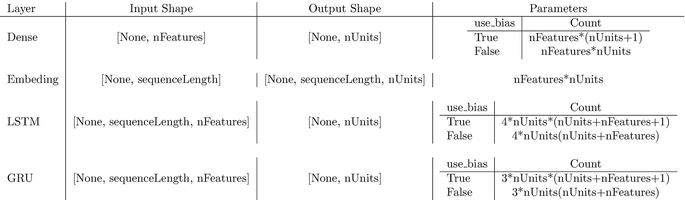
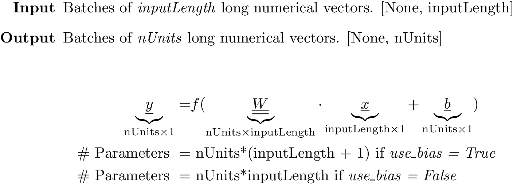
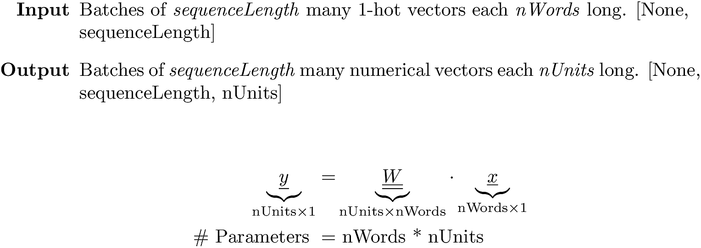
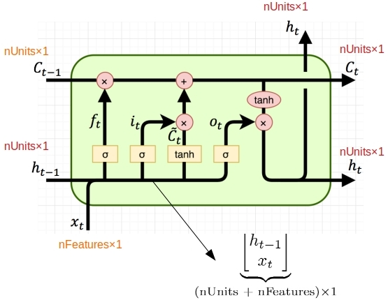
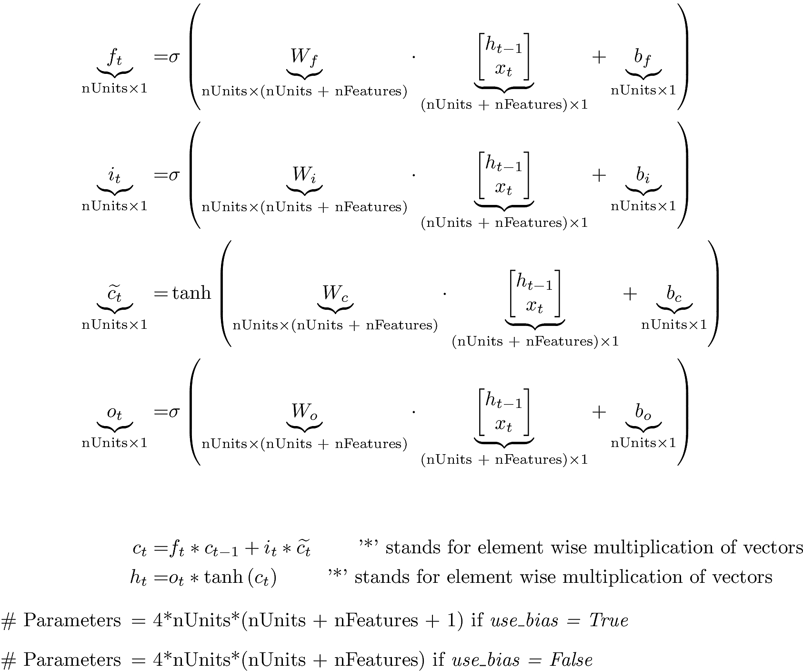
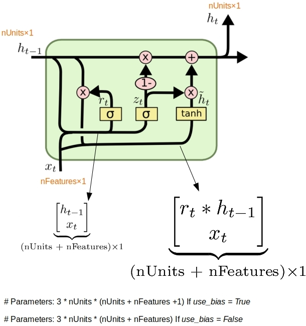

# Flowing Tensors and Heaping Parameters in Deep Learning

This is the source code to go along with the blog article

[Flowing Tensors and Heaping Parameters in Deep Learning](http://xplordat.com/2019/04/25/concept-drift-and-model-decay-in-machine-learning/)

Formulae for trainable parameter counts are developed for a few popular layers in Keras as function of layer parameters and input characteristics. The results are then reconciled with what Keras reports upon running the model.

## Summary

The table below summarizes the parameter counts and input/output tensor shapes for the layers discussed in the article

## Dense Layer

## Embedding Layer

## LSTM Cell

## GRU Cell

## Dependencies

	keras
	tensorflow
	graphviz
	pydot

# Usage

	pipenv run python ./dense_1.py
	pipenv run python ./embed_1.py
	pipenv run python ./lstm.py
	pipenv run python ./gru.py

